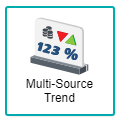
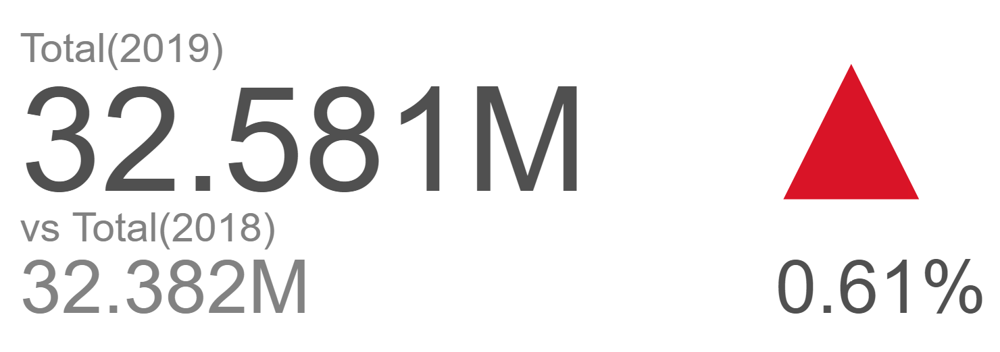
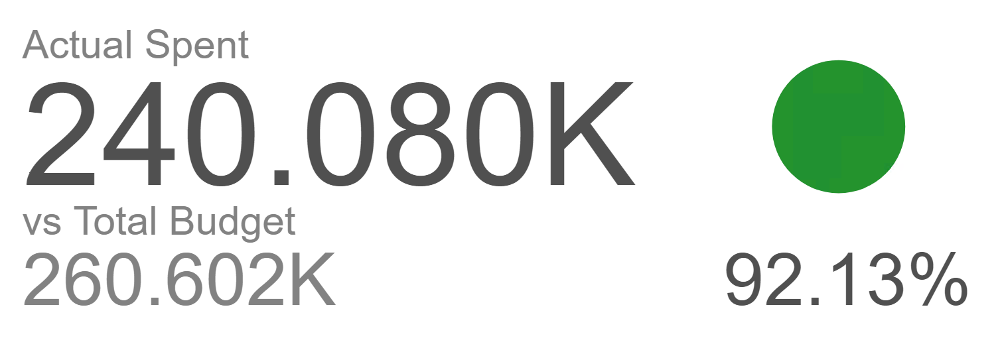

# Multisource Trend Chart

Multisource Trend Chart visualises the trend or traffic that happens between two different numeric values, where they are displayed to showcase the current performance progress towards reaching a goal, or a comparison between the two values. The multisource trend chart displays the values as the current actual value and the target goal to achieve. The data is visualised through text, where the actual value is stated above the target goal value, along with the percentage of trend or traffic on its left-hand side. This chart is regularly used in checking rate performance of a company between the years, or even in creating a progress bar for achieving predicted results.

## Data Binding

To generate the multi-source combination chart, only **TWO** data sources are needed (they can be the same data source or different data source). Before you can proceed with the data binding, you need to first add the Connection Sources to the chart's setting panel. The data binding fields are then available under each of the connection source that you added.

### Source Bindings

The **Source Binding** section will be shown when you have added at least one Connection Source in the chart's Setting panel. Click the arrow icon shown at the end of the connection source name to expand the list of data binding fields for the chart.

*NOTE: Be sure that each data source that you added have relevance to one another for the data analysis to make sense.*

There are a few mandatory bindings to generate the chart within each of the added connection sources, which are the **Actual** and **Target** properties, at least for two different sources (i.e. Source 1 and Source 2). For each property, there are specific data types need to be fulfilled in order for the multi-source combination chart to render correctly, such as can be seen below:

Source #|Bindings|Data Type|
|---|---|---|
|Source 1|Actual|Numeric|
|Source 2|Target|Numeric|

### Actual

Use this field to bind an **Actual** value to *compare against* the **Target** value. The Percentage of Achievement will be shown based on the Threshold setting (the default colours are Red and Green).

### Target

Use this field to bind a **Target** value to *compare against* the **Actual** value. The Percentage of Achievement will be shown based on the Threshold setting (the default colours are Red and Green).

## Other Settings

### Trend Indicator

This setting is used to display the *Trend* or *Traffic* that could be changed accordingly to fit the criteria of the use case. The *Trend* setting displays the difference percentage between the two values. The *Traffic* setting displays the progression percentage between the two values.

### Filter

Another setting that can be used is **Filter** whereby specifying the filter(s) will restrict the values shown so that users can focus on analyzing the filtered data shown in the chart.

### Threshold

When you have the **Actual** and **Target** field bindings, you can specify the threshold for the percentage achievement in this section. The default colours are Red for 0-100% and Green for 100-200%.

## Use Cases

### Financial Budgeting for Actual and Target for Year 2016
A sample dataset of FY company's financial year for 2016 is used to see how their current budgeting compares to their forecasted budgeting. Thus, a multisource trend chart can be used to display their current progress for the year. Download sample data [here](./sample-data/multisource-trend/AnnualBudgetForecast2.xslx). 

Provided within the dataset are the necessary fields needed to generate the multisource combination chart. The **FY16 Budget** field could be used as the **Actual** setting, whereas the **FY16 Forecast** could be used as the **Target** setting. The **Trend Indicator** may be changed at any time to display both types of progress.

Source #|Bindings|Fields to Select|
|---|---|---|
|Source 1|Actual|FY16 Budget|
|Source 2|Target|FY16 Forecast|
||Threshold|Set Range starting from 0 - 100%(Red), 100 - 200%(Green)|

Displayed in the multisource trend chart is the total budget on the actual year and the forecasted year. Both values of Budget and Forecast are represented through a text, where the total sum of both values are used. The trend and traffic is also shown, to ensure the company would be able to get an easy comparison between the two distinct values.

*NOTE: This output shows the **Trend Indicator** examples for the **Trend** and **Traffic** values respectively. The **Trend** within the chart is displayed by a triangle, whereas the **Traffic** within the chart is displayed by a circle.*

**Output**

**Analysis**

The conclusion of the use case chart showcases that the FY16 Budget does not meet up to the criteria of the expected FY16 Forecast, thus it is displayed within both outputs of the trend and traffic graphs, where both values are displayed with a red colour. The FY company could use this graph as a guide to check their progress throughout the year of 2016, where they could make improvements towards their company finance in order to achieve their forecasted result. Furthermore, FY company could also use this graph to predict their financial forecast for future years, setting this current graph as a reference, to ensure the company would achieve better heights in the near future.