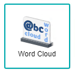
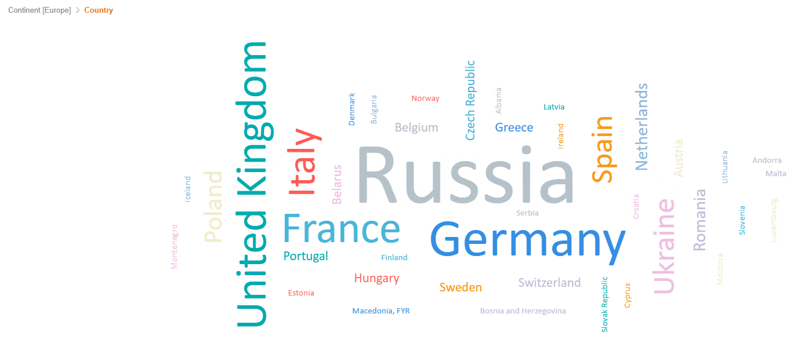
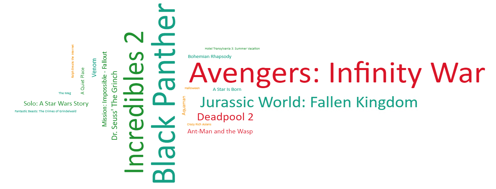

# Word Cloud

Word Cloud chart is a visualisation method that displays how frequently words appear in a given body of text, by aking the size of each word proportional to its frequency. All of the words are arranged in a cloud of words, placing them horizontally and vertically at random, for aesthetic purposes to have easier readibility for the word cloud. This chart helps in analysing text to solve a number of problems, such as simplifying multiple feedback at once, finding out key patterns in data, and search engine optimisation.

## Data Binding

For the word cloud chart, there is only one mandatory binding to generate the chart which is the **Group** property. For each property, there is a specific data type needed to fulfill in order for the word cloud chart to render correctly, such as can be seen below:

|Bindings |Data Type|
|---|---|
|Group|String|

### Group

With the **Group** binding, a string field could be used for giving categories on the chart generation as the datasets used would generally have alot of values that are linked to values on another field.

## Other Settings

### Size

With the **Size** binding, a numerical field could be used for giving a sample size on the graph for the word cloud to display on how much is the frequency value by the size of each word.

### Actual

On this setting, the **Actual** values are used as the fields to be set as a standard for achieving a trend to be seen through the word cloud chart.

### Target

On this setting the expected or **Target** values are used as the field to be set as the goal for achieving a trend to be seen through the word cloud chart.

### Threshold

To find out if a trend could be achieved, a range could be set within the **Threshold** setting to alter percentages for the the **Actual** trend to what is the **Target** trend, thus getting displayed within the word cloud chart in a set of colours to distinguish the differences.

### Drill Down

The **Drill Down** setting adds a level of detail on the data on the word cloud chart would display if a hierarchically structured dataset is used.

### Sort

For huge data sets, a setting called **Sort** can be used to alter the word cloud chart on different specifics that the user wants to view or create on the chart.

### Filtering

Another setting that could be used is **Filter** where it applies filters to restrict or focus on data shown in the chart.

## Use Cases

### Population of Citizens within a Country
A dataset of a nation's population count is used to see the which country has the most amount of people, thus using a word cloud would be a very easy method to display on the size of the population of each continent and country specifically. Download sample data [here](./sample-data/word-cloud/population.csv).

As seen in the dataset, there are a few values that could be deemed as important for the generation of the word cloud. These fields are **Continent** and **Population**. The **Country** field will be used within the drill down setting to create a level of hierarchy for the word cloud.

|Bindings |Field to Select|
|---|---|
|Group|Continent|
|Size|Population|
|Drill Down|Country|

Displayed in the word cloud are the continents that have their population count according to the size of each word. Not only that, by using the drill down setting, several other word clouds could be generated to focus on certain continents of choice.

*Note:* This output will only display the **Drill Down** for the Asia and Europe continents, where a breadcrumb on the top-left of the chart will display which level is being displayed.

**Output**

### Top Movies of 2018 by the Domestic Box Office
The current dataset shows a list of the most popular movies in the year 2018, where it is ranked according to the Domestic Box Office. Download sample data [here](./sample-data/word-cloud/movies.xlsx).

For the creation of the word cloud chart, the top movies of 2018 by domestic box office use case utilises all of their fields given, which are **Title**, **Domestic Gross**, **Metacritic Score** and **Rotten Tomatoes Score**. Both of the score fields from Metacritic and Rotten Tomatoes will be used the for the actual and target settings to analyse if the movies achieve similar ratings from two different parties.

|Bindings |Select|
|---|---|
|Group|Title|
|Size|Domestic Gross|
|Actual|Metacritic Score|
|Target|Rotten Tomatoes Score|
|Threshold|Set Trending to *Increasing Better*|
||Set Range starting from 75%, 80%, 85%, 90% to 95%|

 Within the chart are the movies displayed through their **Domestic Gross**, **Metacritic Score** and **Rotten Tomatoes Score**. The size/frequency of each word is dependant on the domestic gross, whereas the different colours of the words display whether the trend threshold of the scores is achieved.

**Output**

**Analysis**

By analysing the chart deeper, the actual and target trend is set as for the Metacritic score to achieve similar values to Rotten Tomatoes score, where it can be deducted that although a movie grosses a high domestic value, it would not get a high score rating on both parties. Following on, it can also be found that the data is simplified for the ease of view, in order to capture all necessary information at once, knowing which movie is more popular towards critics or regular citizens.